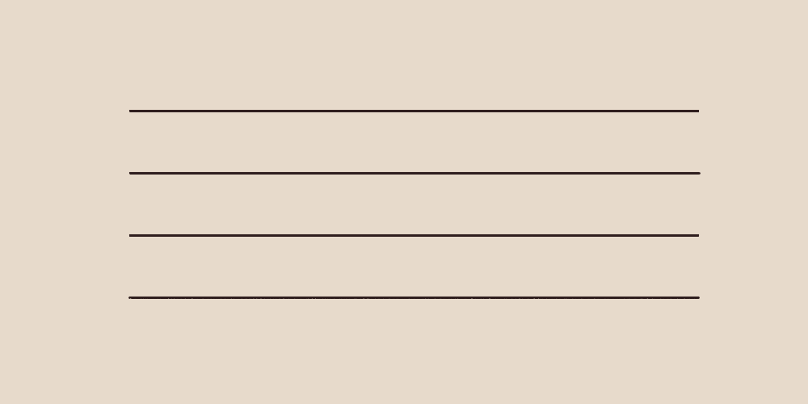
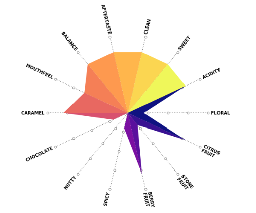

# creative

A personal ripoff of [`sadielbartholomew`](https://github.com/sadielbartholomew) excellent [`creative-matplotlib`](https://github.com/sadielbartholomew/creative-matplotlib) repository.

## `textured_lines`

The goal of this is to create lines that look like they have been drawn in pencil:

## `coffee_spiders`

A programmatic replication of the diagrams used by [Artisan Roast](https://artisanroast.co.uk) to describe their coffees. 

